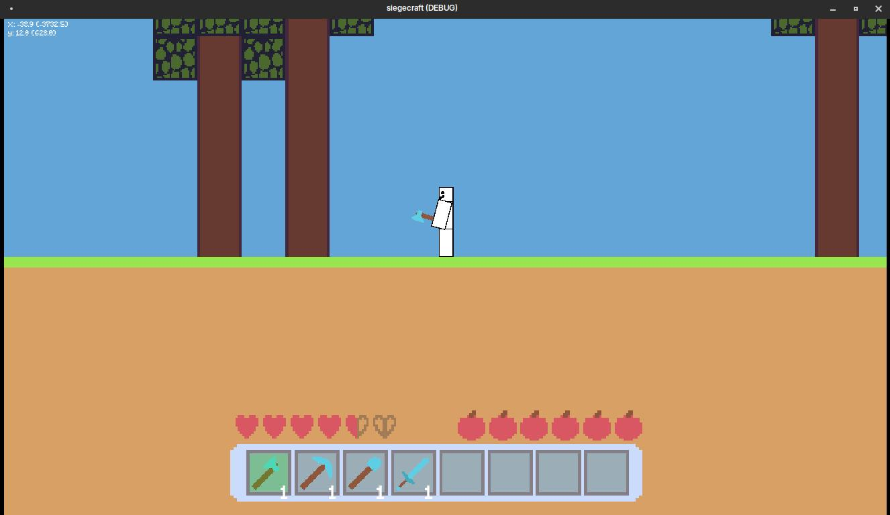
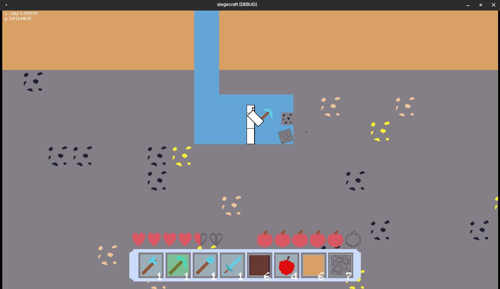
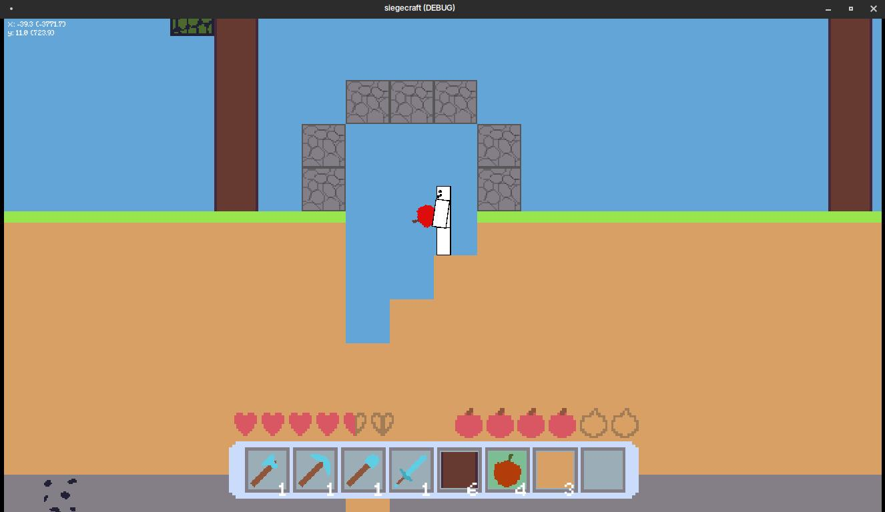
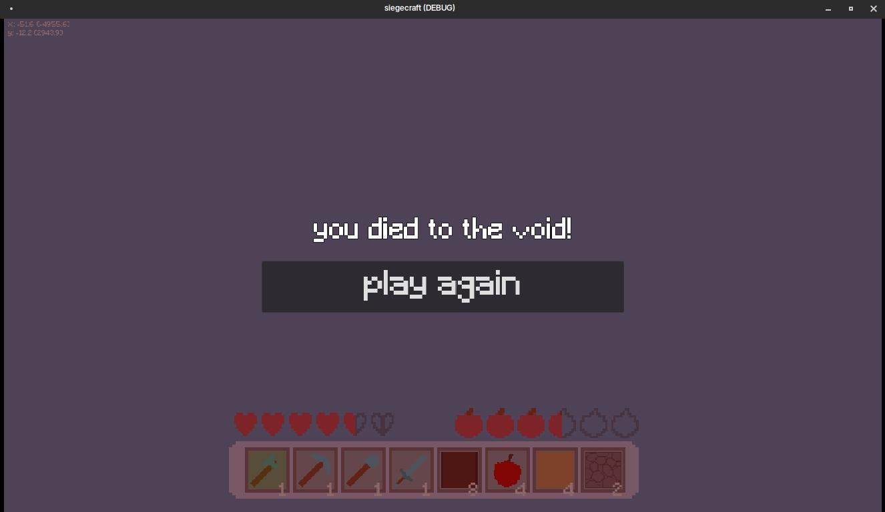
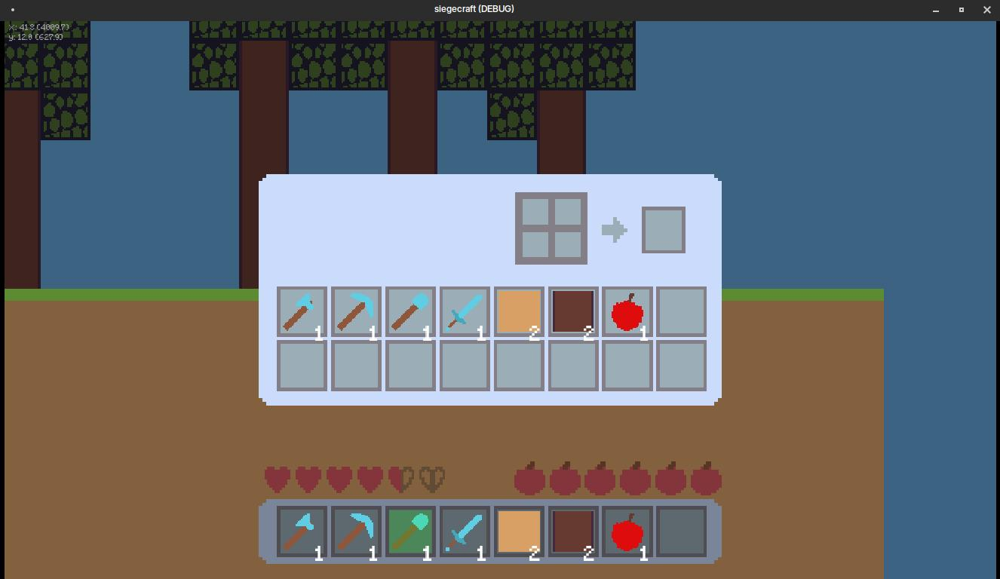

# siegecraft

is my attempt at making a full 2D Godot game for a coding challenge (siege.hackclub.com),
where I had to follow the theme: GRID. I did not anticipate for me to
implement this little features in ~14 hours, so written below is everything
you can (not) do in Siegecraft!

(You can see in my code that I prepared everything for the features,
the time just wasn't sufficient xd)

## Gallery

## Features

- Player loses hunger over time and needs apples to not die of starvation
- Static floor generation with dynamic tree generation (location & frequency)
- Breaking & placing blocks
- Player animations for walking, jumping, looking around, and breaking
- Bedrock is mineable

## What I wanted to implement
.. but didn't have the time to:

- Crafting
- Inventory sorting
- Furnace functionality
- Nether & The End

## Credits
- font: https://www.dafont.com/de/minecraft.font
- all sound effects from Minecraft
